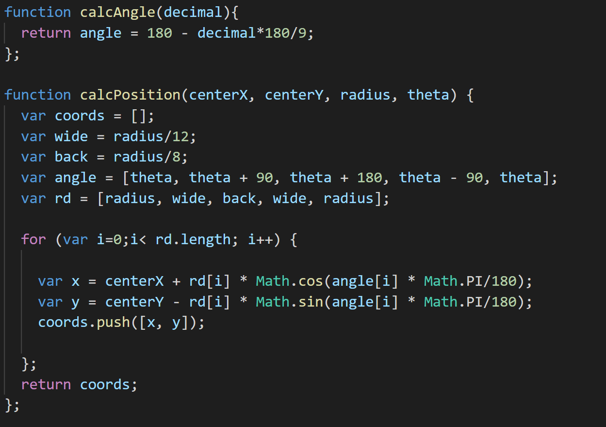

Plotly Homework
In this challenge, I did the qualified job in creating the web visualization for data from SQliteDB on local host. 
Homework Overview:
The tasks require accessing the database to get the sample that user chooses to show on the web, there are two jobs needed to do that are get first top ten ids from route: **/samples/<sample>** and metadata from route: **/metadata/<sample>**.
On App.py, I used Flask to develop route to acquire the data from database through create_engine and session. 
Initially, App.js will get names from route **/names** to feed data to menus.
  
  
Every time, the user chooses the sample number from drop down list, the app.js will update the charts and metadata field.

  
  
In buildPlots function, we have to update two charts; pie chart and bubble chart.

In buildMetadata function, we will update the metadata field and update the gauge chart using WFREQ data.

For more details in gauge chart, I used a pie chart (doughnut) and a svg to build a gauge chart.
The information for the pie chart is followed:

After the pie chart is build, I will add an svg with path into that pie chart to show the pointer.

In the path svg chart, we calculate the location of path based on two function calcAngle and calcPosition.

In this homework, I will deploy the resource on Heroku and we can open the web visualization online as the link:

https://congtranxuan-belly-button.herokuapp.com/

So what the final view is:

